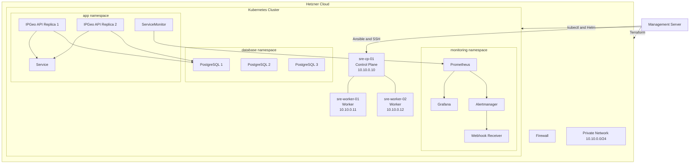

# Cloud-Native IP Geolocation Platform

A reproducible cloud-native platform that provisions Kubernetes infrastructure on Hetzner Cloud, installs Kubernetes with Ansible, deploys a three-instance PostgreSQL cluster with CloudNativePG, runs a FastAPI IP geolocation service, and provides monitoring with Prometheus, Grafana, and Alertmanager.

> This repository is intended as a practical, public, end-to-end reference implementation. It is deliberately small enough to understand while still covering infrastructure as code, configuration management, Kubernetes operations, database high availability, application observability, alert routing, and operational validation.

---

## Table of contents

- [Overview](#overview)
- [Features](#features)
- [Architecture](#architecture)
- [Current topology](#current-topology)
- [Repository layout](#repository-layout)
- [Prerequisites](#prerequisites)
- [Security and secret management](#security-and-secret-management)
- [Deployment workflow](#deployment-workflow)
- [1. Prepare the management server](#1-prepare-the-management-server)
- [2. Create an SSH key](#2-create-an-ssh-key)
- [3. Create a Hetzner API token](#3-create-a-hetzner-api-token)
- [4. Configure Terraform](#4-configure-terraform)
- [5. Initialize and validate Terraform](#5-initialize-and-validate-terraform)
- [6. Provision infrastructure](#6-provision-infrastructure)
- [7. Generate the Ansible inventory](#7-generate-the-ansible-inventory)
- [8. Install Kubernetes](#8-install-kubernetes)
- [9. Configure kubectl](#9-configure-kubectl)
- [10. Install platform services](#10-install-platform-services)
- [11. Prepare the application image](#11-prepare-the-application-image)
- [12. Deploy PostgreSQL and the API](#12-deploy-postgresql-and-the-api)
- [13. Apply monitoring resources](#13-apply-monitoring-resources)
- [14. Verify the deployment](#14-verify-the-deployment)
- [API usage](#api-usage)
- [Monitoring](#monitoring)
- [Grafana](#grafana)
- [Alertmanager](#alertmanager)
- [PostgreSQL](#postgresql)
- [Secret rotation](#secret-rotation)
- [Troubleshooting](#troubleshooting)
- [Cleanup](#cleanup)
- [Limitations](#limitations)
- [Roadmap](#roadmap)
- [Pre-commit checks](#pre-commit-checks)
- [License](#license)

---

## Overview

The platform implements this workflow:

1. Terraform creates three Ubuntu servers, a private network, a subnet, a firewall, and an SSH key in Hetzner Cloud.
2. Ansible installs a Kubernetes cluster with one control-plane node and two workers.
3. Kubernetes runs Local Path Provisioner, CloudNativePG, Prometheus, Grafana, Alertmanager, and the IP geolocation API.
4. The FastAPI service validates an IP address, queries `ipwho.is`, stores the result in PostgreSQL, and exposes Prometheus metrics.
5. Prometheus scrapes the application through a `ServiceMonitor`.
6. Grafana displays the application dashboard.
7. Alertmanager routes application alerts to an in-cluster webhook receiver.

---

## Features

| Area | Capability |
|---|---|
| Infrastructure | Terraform-based Hetzner provisioning |
| Networking | Private network, subnet, and restricted firewall |
| Configuration | Ansible-based Kubernetes installation |
| Kubernetes | One control plane and two workers |
| CNI | Calico |
| Storage | Local Path Provisioner |
| Database | Three-instance PostgreSQL cluster |
| Operator | CloudNativePG |
| API | FastAPI |
| Persistence | IP lookup records stored in PostgreSQL |
| Health | Readiness and liveness probes |
| Metrics | Prometheus client metrics |
| Discovery | Prometheus Operator `ServiceMonitor` |
| Monitoring | kube-prometheus-stack |
| Dashboards | Provisioned Grafana dashboard |
| Alerting | Seven application-specific Prometheus rules |
| Notifications | Alertmanager webhook receiver |
| Automation | Makefile and shell scripts |
| Security | Runtime-injected credentials and ignored local secrets |

---

## Architecture



---

## Current topology

| Server | Private IP | Role |
|---|---:|---|
| `sre-cp-01` | `10.10.0.10` | Kubernetes control plane |
| `sre-worker-01` | `10.10.0.11` | Kubernetes worker |
| `sre-worker-02` | `10.10.0.12` | Kubernetes worker |

The management server is not created by Terraform. It runs Terraform, Ansible, `kubectl`, Helm, Docker, and supporting tools.

The control plane is not highly available. PostgreSQL uses three instances, but the current storage backend is node-local.

---

## Repository layout

```text
.
├── Makefile
├── README.md
├── ansible/
├── app/
├── kubernetes/
├── scripts/
└── terraform/
```

| Path | Purpose |
|---|---|
| `terraform/` | Provisions Hetzner infrastructure |
| `ansible/` | Installs Kubernetes |
| `app/` | Contains the FastAPI service and Dockerfile |
| `kubernetes/` | Contains application, database, and monitoring manifests |
| `scripts/` | Contains deployment, validation, inventory, and cleanup scripts |
| `Makefile` | Provides the main operator interface |
| `.gitignore` | Excludes secrets, state, kubeconfig, inventory, and generated files |

---

## Prerequisites

### Infrastructure

- One Linux management server.
- A Hetzner Cloud account.
- Permission to create servers, networks, firewalls, and SSH keys.
- A stable public IPv4 address on the management server.
- Capacity for three Hetzner servers.

### Tools

Install or provide:

- `git`
- `make`
- `terraform`
- `ansible`
- `kubectl`
- `helm`
- `jq`
- `docker`
- `curl`
- `ssh`
- `scp`

Check them:

```bash
for tool in git make terraform ansible-playbook kubectl helm jq docker curl ssh scp; do command -v "$tool" >/dev/null 2>&1 && echo "OK: $tool" || echo "MISSING: $tool"; done
```

Display versions:

```bash
terraform version && ansible-playbook --version && kubectl version --client && helm version && docker version
```

Recommended management server:

- Ubuntu 22.04 or 24.04.
- 2 or more CPU cores.
- 4 GiB or more RAM.
- 20 GiB or more disk.
- Outbound internet access.

---

## Security and secret management

This repository intentionally contains no real credentials.

### Never commit

- Hetzner API tokens.
- `terraform/terraform.tfvars`.
- Terraform state.
- `kubeconfig`.
- `ansible/inventory.ini`.
- SSH private keys.
- Database passwords.
- Grafana passwords.
- Registry credentials.
- `.env` files containing secrets.
- Kubernetes Secret manifests containing real values.

Verify ignore rules:

```bash
git check-ignore -v kubeconfig terraform/terraform.tfstate terraform/terraform.tfvars terraform/.terraform ansible/inventory.ini
```

### Runtime variables

| Variable | Purpose |
|---|---|
| `TF_VAR_hcloud_token` | Hetzner Cloud authentication |
| `GRAFANA_PASSWORD` | Initial Grafana administrator password |
| `DB_PASSWORD` | PostgreSQL application password |
| `APP_IMAGE` | Application container image |

Read secrets without echoing them:

```bash
read -rsp "Hetzner API token: " TF_VAR_hcloud_token && export TF_VAR_hcloud_token && echo
```

```bash
read -rsp "Grafana admin password: " GRAFANA_PASSWORD && export GRAFANA_PASSWORD && echo
```

```bash
read -rsp "Database password: " DB_PASSWORD && export DB_PASSWORD && echo
```

Check only whether values exist:

```bash
for variable in TF_VAR_hcloud_token GRAFANA_PASSWORD DB_PASSWORD; do [[ -n "${!variable:-}" ]] && echo "SET: $variable" || echo "MISSING: $variable"; done
```

Avoid putting real passwords directly in commands because shell history may retain them.

Kubernetes Secrets are base64-encoded, not encrypted by default. Production environments should enable encryption at rest or use an external secret manager.

Terraform state may contain sensitive infrastructure metadata. The current project stores it locally and excludes it from Git. Team environments should use an encrypted remote backend with locking.

---

## Deployment workflow

```mermaid
flowchart LR
    A[Prepare host] --> B[Create SSH key]
    B --> C[Set token]
    C --> D[Configure Terraform]
    D --> E[Terraform plan]
    E --> F[Terraform apply]
    F --> G[Generate inventory]
    G --> H[Install Kubernetes]
    H --> I[Install platform]
    I --> J[Prepare image]
    J --> K[Deploy database and API]
    K --> L[Apply monitoring]
    L --> M[Verify]
```



Available Make targets:

```bash
make help
```

| Target | Action |
|---|---|
| `make tf-init` | Initialize Terraform |
| `make tf-plan` | Format-check, validate, and plan |
| `make tf-apply` | Create Hetzner resources |
| `make inventory` | Generate Ansible inventory |
| `make cluster` | Install Kubernetes |
| `make platform` | Install storage, monitoring, and CloudNativePG |
| `make app` | Deploy PostgreSQL and the API |
| `make check` | Display important status |
| `make destroy` | Delete workloads and destroy infrastructure |

---

## 1. Prepare the management server

Clone the repository:

```bash
git clone <REPOSITORY_URL> ipgeo-platform && cd ipgeo-platform
```

Validate shell syntax:

```bash
for file in scripts/*.sh; do bash -n "$file" || exit 1; done
```

No output means all scripts passed syntax validation.

Ensure scripts are executable:

```bash
chmod +x scripts/*.sh
```

---

## 2. Create an SSH key

Create the default key:

```bash
ssh-keygen -t ed25519 -a 100 -f "$HOME/.ssh/ipgeo-platform" -C "ipgeo-platform"
```

Options:

- `-t ed25519`: Ed25519 key type.
- `-a 100`: stronger passphrase derivation.
- `-f`: output path.
- `-C`: key comment.

Set permissions:

```bash
chmod 600 "$HOME/.ssh/ipgeo-platform" && chmod 644 "$HOME/.ssh/ipgeo-platform.pub"
```

Verify:

```bash
ls -l "$HOME/.ssh/ipgeo-platform" "$HOME/.ssh/ipgeo-platform.pub"
```

Never commit or share the private key.

---

## 3. Create a Hetzner API token

Create a read/write API token in the target Hetzner Cloud project.

Load it:

```bash
read -rsp "Hetzner API token: " TF_VAR_hcloud_token && export TF_VAR_hcloud_token && echo
```

Verify it is present:

```bash
[[ -n "${TF_VAR_hcloud_token:-}" ]] && echo "Hetzner token is loaded" || echo "Hetzner token is missing"
```

The `TF_VAR_` prefix maps the environment variable to Terraform variable `hcloud_token`.

---

## 4. Configure Terraform

Create the local configuration:

```bash
cp terraform/terraform.tfvars.example terraform/terraform.tfvars
```

Edit:

```bash
nano terraform/terraform.tfvars
```

Example:

```hcl
project_name        = "ipgeo-platform"
location            = "nbg1"
server_type         = "cx23"
image               = "ubuntu-24.04"
ssh_public_key_path = "~/.ssh/ipgeo-platform.pub"
admin_cidr          = "203.0.113.10/32"
network_cidr        = "10.10.0.0/24"
```

Replace `203.0.113.10/32` with the public IPv4 address of the management server.

Find the public IPv4 address:

```bash
curl -4 https://ifconfig.me && echo
```

Append `/32` to allow one IPv4 address only.

Variables:

| Variable | Required | Default |
|---|---:|---|
| `hcloud_token` | Yes | None |
| `project_name` | No | `ipgeo-platform` |
| `location` | No | `nbg1` |
| `server_type` | No | `cx23` |
| `image` | No | `ubuntu-24.04` |
| `ssh_public_key_path` | No | `~/.ssh/ipgeo-platform.pub` |
| `admin_cidr` | Yes | None |
| `network_cidr` | No | `10.10.0.0/24` |

Confirm the local file is ignored:

```bash
git check-ignore -v terraform/terraform.tfvars
```

---

## 5. Initialize and validate Terraform

Initialize:

```bash
make tf-init
```

Format:

```bash
terraform -chdir=terraform fmt
```

Validate:

```bash
terraform -chdir=terraform validate
```

Expected:

```text
Success! The configuration is valid.
```

Plan:

```bash
make tf-plan
```

Review every create, update, replace, and destroy action before applying.

---

## 6. Provision infrastructure

Apply:

```bash
make tf-apply
```

Type `yes` only after reviewing the plan.

Display outputs:

```bash
terraform -chdir=terraform output
```

Inspect node output:

```bash
terraform -chdir=terraform output -json nodes | jq
```

Verify:

- Three servers.
- One private network.
- One subnet.
- One firewall.
- One SSH key.
- Expected private IP addresses.
- SSH and Kubernetes API access limited to the management server.

---

## 7. Generate the Ansible inventory

Generate:

```bash
make inventory
```

The script reads Terraform outputs and writes `ansible/inventory.ini`.

Inspect it:

```bash
cat ansible/inventory.ini
```

Verify permissions:

```bash
stat -c '%a %n' ansible/inventory.ini
```

Expected:

```text
600 ansible/inventory.ini
```

Use another key:

```bash
SSH_KEY="$HOME/.ssh/another-key" make inventory
```

Test connectivity:

```bash
ANSIBLE_CONFIG=ansible/ansible.cfg ansible -i ansible/inventory.ini all -m ping
```

Every node should return `pong`.

---

## 8. Install Kubernetes

Run:

```bash
make cluster
```

Check kubelet through Ansible:

```bash
ANSIBLE_CONFIG=ansible/ansible.cfg ansible -i ansible/inventory.ini k8s_cluster -b -m shell -a 'systemctl is-active kubelet'
```

Expected: `active` on all nodes.

---

## 9. Configure kubectl

Set the project kubeconfig:

```bash
export KUBECONFIG="$PWD/kubeconfig"
```

Verify access:

```bash
kubectl cluster-info
```

Check nodes:

```bash
kubectl get nodes -o wide
```

Expected:

- Three nodes.
- All `Ready`.
- One control plane.
- Two workers.

Check system pods:

```bash
kubectl get pods -n kube-system -o wide
```

Check Calico:

```bash
kubectl get pods -n calico-system -o wide
```

---

## 10. Install platform services

Set the Grafana password:

```bash
read -rsp "Grafana admin password: " GRAFANA_PASSWORD && export GRAFANA_PASSWORD && echo
```

Install:

```bash
make platform
```

The script currently:

1. Installs Local Path Provisioner.
2. Makes `local-path` the default StorageClass.
3. Adds Helm repositories.
4. Installs CloudNativePG.
5. Installs kube-prometheus-stack version `87.15.2`.
6. Applies namespaces.
7. Applies application Prometheus rules.
8. Applies the baseline dashboard manifest.

Verify storage:

```bash
kubectl get storageclass
```

Verify CloudNativePG:

```bash
kubectl get pods -n cnpg-system
```

Verify monitoring:

```bash
kubectl get pods -n monitoring
```

---

## 11. Prepare the application image

Build:

```bash
docker build -t ipgeo-api:v1.0.1 app
```

Verify:

```bash
docker image inspect ipgeo-api:v1.0.1 >/dev/null && echo "Image exists"
```

### Important image policy

The current application manifest uses:

```yaml
imagePullPolicy: IfNotPresent
```

Therefore Kubernetes will not pull the image. The exact image must already exist in the container runtime of every node that may run the API.

Current image setting:

```bash
export APP_IMAGE="ghcr.io/GITHUB_USERNAME/ipgeo-api:v1.0.0"
```

For a public or production deployment, the recommended approach is:

1. Push the image to a registry.
2. Change `imagePullPolicy` to `IfNotPresent` or `Always`.
3. Set `APP_IMAGE` to the registry image.

Example:

```bash
export APP_IMAGE="ghcr.io/GITHUB_USERNAME/ipgeo-api:v1.0.0"
```

---

## 12. Deploy PostgreSQL and the API

Set the database password:

```bash
read -rsp "Database password: " DB_PASSWORD && export DB_PASSWORD && echo
```

Set the image:

```bash
export APP_IMAGE="ghcr.io/GITHUB_USERNAME/ipgeo-api:v1.0.0"
```

Confirm variables:

```bash
for variable in APP_IMAGE DB_PASSWORD; do [[ -n "${!variable:-}" ]] && echo "SET: $variable" || echo "MISSING: $variable"; done
```

Deploy:

```bash
make app
```

The script:

1. Applies namespaces.
2. Creates the database bootstrap Secret if absent.
3. Creates or updates the app namespace Secret.
4. Applies the CloudNativePG cluster.
5. Waits for database readiness.
6. replaces `IMAGE_PLACEHOLDER`.
7. Applies the application manifest.
8. Waits for the API rollout.

Verify database:

```bash
kubectl get cluster -n database
```

Verify pods:

```bash
kubectl get pods -n database -o wide
```

Verify application:

```bash
kubectl get deployment,pods,service,servicemonitor -n app -o wide
```

Expected:

- Three PostgreSQL pods.
- Two API replicas.
- One API Service.
- One ServiceMonitor.

---

## 13. Apply monitoring resources

Apply rules:

```bash
kubectl apply -f kubernetes/monitoring/ipgeo-prometheus-rules.yaml
```

Apply Alertmanager routing:

```bash
kubectl apply -f kubernetes/monitoring/alertmanager/ipgeo-alertmanager-config.yaml
```

Apply Grafana dashboard ConfigMap:

```bash
kubectl apply -f kubernetes/monitoring/grafana/ipgeo-api-dashboard-configmap.yaml
```

Verify labels:

```bash
kubectl get prometheusrule ipgeo-api-rules -n monitoring -o jsonpath='{.metadata.labels.app\.kubernetes\.io/part-of}{"\n"}'
```

```bash
kubectl get alertmanagerconfig ipgeo-api-routing -n monitoring -o jsonpath='{.metadata.labels.app\.kubernetes\.io/part-of}{"\n"}'
```

Expected:

```text
ipgeo-platform
```

List rules:

```bash
kubectl get prometheusrule ipgeo-api-rules -n monitoring -o jsonpath='{range .spec.groups[*]}{.name}{"\n"}{range .rules[*]}{"  - "}{.alert}{"\n"}{end}{end}'
```

Expected:

```text
ipgeo-api.availability
  - IPGeoAPINoHealthyTargets
  - IPGeoAPITargetMissing
  - IPGeoAPIReplicaDegraded
  - IPGeoAPINoAvailableReplicas
ipgeo-api.runtime
  - IPGeoAPIContainerRestarting
  - IPGeoAPIHighInvalidRequestRatio
  - IPGeoAPINoSuccessfulLookups
```

---

## 14. Verify the deployment

Run:

```bash
make check
```

The current check script displays:

- Nodes.
- Pods in all namespaces.
- CloudNativePG cluster.
- Prometheus and Alertmanager resources.
- API deployment, Service, and ServiceMonitor.

Full status:

```bash
kubectl get pods -A
```

Nodes:

```bash
kubectl get nodes -o wide
```

Database:

```bash
kubectl get cluster -n database
```

Monitoring:

```bash
kubectl get prometheus,alertmanager -n monitoring
```

API rollout:

```bash
kubectl rollout status deployment/ipgeo-api -n app --timeout=5m
```

Port-forward the API:

```bash
kubectl port-forward -n app service/ipgeo-api 8080:80
```

In another terminal, test health:

```bash
curl -fsS http://127.0.0.1:8080/health
```

Expected:

```json
{"status":"ok"}
```

Test metrics:

```bash
curl -fsS http://127.0.0.1:8080/metrics | grep ipgeo_lookup_total
```

Test lookup:

```bash
curl -fsS -X POST http://127.0.0.1:8080/lookup/8.8.8.8
```

Example:

```json
{"ip":"8.8.8.8","country":"United States","country_code":"US"}
```

Test invalid input:

```bash
curl -i -X POST http://127.0.0.1:8080/lookup/not-an-ip
```

Expected: HTTP `400`.

---

## API usage

### Health

```http
GET /health
```

### Metrics

```http
GET /metrics
```

### Lookup

```http
POST /lookup/{ip_address}
```

Error behavior:

| Condition | Status |
|---|---:|
| Invalid IP syntax | `400` |
| Upstream geolocation failure | `502` |
| PostgreSQL failure | `502` |
| Network timeout | `502` |

The current application exposes the internal exception message in `502` responses. Production hardening should return a stable public error and log details separately.

---

## Monitoring

The monitoring stack includes:

- Prometheus Operator.
- Prometheus.
- Alertmanager.
- Grafana.
- kube-state-metrics.
- node-exporter.

The application exposes `/metrics`.

The ServiceMonitor scrapes:

- Port: `http`
- Path: `/metrics`
- Interval: `30s`

Port-forward Prometheus:

```bash
kubectl port-forward -n monitoring service/monitoring-kube-prometheus-prometheus 9090:9090
```

Open `http://127.0.0.1:9090`.

Query:

```promql
ipgeo_lookup_total
```

Useful PromQL:

```promql
sum(rate(ipgeo_lookup_total[5m]))
```

```promql
sum(rate(ipgeo_lookup_total{status="success"}[5m]))
```

```promql
sum(rate(ipgeo_lookup_total{status="error"}[5m]))
```

---

## Grafana

Port-forward:

```bash
kubectl port-forward -n monitoring service/monitoring-grafana 3000:80
```

Open `http://127.0.0.1:3000`.

Username:

```text
admin
```

Password: the value supplied as `GRAFANA_PASSWORD`.

Dashboard:

```text
IPGeo API — Service Overview
```

UID:

```text
ipgeo-api-overview
```

Verify ConfigMap:

```bash
kubectl get configmap ipgeo-api-grafana-dashboard -n monitoring
```

Check sidecar logs:

```bash
kubectl logs -n monitoring deployment/monitoring-grafana -c grafana-sc-dashboard --tail=100
```

---

## Alertmanager

AlertmanagerConfig:

```text
ipgeo-api-routing
```

Receiver:

```text
ipgeo-webhook
```

Webhook:

```text
http://alert-webhook-receiver.monitoring.svc.cluster.local:8080/alerts
```

Resolved notifications are enabled.

Check receiver:

```bash
kubectl get deployment,service,pods -n monitoring -l app=alert-webhook-receiver
```

Check health:

```bash
kubectl run curl-check --rm -i --restart=Never --image=curlimages/curl -- curl -fsS http://alert-webhook-receiver.monitoring.svc.cluster.local:8080/health
```

Check logs:

```bash
kubectl logs -n monitoring deployment/alert-webhook-receiver --tail=100
```

Safe non-production outage test:

```bash
kubectl scale deployment/ipgeo-api -n app --replicas=0
```

Restore:

```bash
kubectl scale deployment/ipgeo-api -n app --replicas=2 && kubectl rollout status deployment/ipgeo-api -n app --timeout=5m
```

---

## PostgreSQL

Configuration:

- Cluster: `postgres`
- Namespace: `database`
- Instances: `3`
- Database: `ipgeo`
- Owner: `app`
- StorageClass: `local-path`
- Volume size: `5Gi`
- PodMonitor: enabled

Check cluster:

```bash
kubectl get cluster postgres -n database -o wide
```

Check instances:

```bash
kubectl get pods -n database -l cnpg.io/cluster=postgres -o wide
```

Show roles:

```bash
kubectl get pods -n database -l cnpg.io/cluster=postgres -L role
```

The application connects to:

```text
postgres-rw.database.svc.cluster.local:5432
```

---

## Secret rotation

### Database password

Changing the Kubernetes Secret alone may not change the password inside PostgreSQL.

A safe rotation process:

1. Generate a new password.
2. Change the PostgreSQL role password.
3. Update both namespace Secrets.
4. Restart the API.
5. Verify connectivity.
6. remove the old value from temporary locations.

Generate:

```bash
openssl rand -base64 32
```

Inside PostgreSQL:

```sql
ALTER ROLE app WITH PASSWORD 'NEW_STRONG_PASSWORD';
```

Update database namespace:

```bash
kubectl create secret generic app-db-secret -n database --from-literal=username=app --from-literal=password="$DB_PASSWORD" --dry-run=client -o yaml | kubectl apply -f -
```

Update app namespace:

```bash
kubectl create secret generic app-db-secret -n app --from-literal=username=app --from-literal=password="$DB_PASSWORD" --dry-run=client -o yaml | kubectl apply -f -
```

Restart:

```bash
kubectl rollout restart deployment/ipgeo-api -n app && kubectl rollout status deployment/ipgeo-api -n app --timeout=5m
```

---

## Troubleshooting

### Terraform authentication failure

Check:

```bash
[[ -n "${TF_VAR_hcloud_token:-}" ]] && echo "Token is set" || echo "Token is missing"
```

Reload:

```bash
read -rsp "Hetzner API token: " TF_VAR_hcloud_token && export TF_VAR_hcloud_token && echo
```

### Ansible cannot connect

Test SSH:

```bash
ssh -i "$HOME/.ssh/ipgeo-platform" root@"$(terraform -chdir=terraform output -json nodes | jq -r '.["sre-cp-01"].public_ip')"
```

Test Ansible:

```bash
ANSIBLE_CONFIG=ansible/ansible.cfg ansible -i ansible/inventory.ini all -m ping -vv
```

Check firewall, public IPs, key path, permissions, and `ansible_user`.

### kubectl cannot connect

Set:

```bash
export KUBECONFIG="$PWD/kubeconfig"
```

Inspect:

```bash
kubectl config view --minify
```

Check firewall access to TCP `6443`.

### Node is NotReady

Describe:

```bash
kubectl describe node <NODE_NAME>
```

Check Calico:

```bash
kubectl get pods -n calico-system -o wide
```

Check events:

```bash
kubectl get events -A --sort-by='.lastTimestamp' | tail -n 100
```

### ImagePullBackOff or ErrImagePull

These errors indicate that Kubernetes could not download the configured application image from the container registry.

Inspect the pod and recent events:

```bash
kubectl describe pod -n app -l app=ipgeo-api
```

Common causes include an incorrect image name, a missing image tag, an unavailable registry, or missing authentication for a private package. Verify that `APP_IMAGE` references an existing image and that the package is publicly readable or an appropriate `imagePullSecret` is configured.

### CrashLoopBackOff

Logs:

```bash
kubectl logs -n app deployment/ipgeo-api --all-containers=true --previous
```

Check Secret:

```bash
kubectl get secret app-db-secret -n app
```

Check database:

```bash
kubectl get cluster postgres -n database
```

### PostgreSQL not ready

Describe:

```bash
kubectl describe cluster postgres -n database
```

Operator logs:

```bash
kubectl logs -n cnpg-system deployment/cnpg-cloudnative-pg --tail=200
```

PVCs:

```bash
kubectl get pvc -n database
```

### PVC Pending

Describe:

```bash
kubectl describe pvc -n database
```

Check provisioner:

```bash
kubectl get pods -n local-path-storage
```

### Prometheus target missing

Check ServiceMonitor:

```bash
kubectl get servicemonitor ipgeo-api -n app -o yaml
```

Check labels:

```bash
kubectl get service ipgeo-api -n app --show-labels
```

Check endpoint:

```bash
kubectl get endpoints ipgeo-api -n app
```

Test metrics internally:

```bash
kubectl run curl-metrics --rm -i --restart=Never --image=curlimages/curl -- curl -fsS http://ipgeo-api.app.svc.cluster.local/metrics
```

### Dashboard missing

Check ConfigMap:

```bash
kubectl get configmap ipgeo-api-grafana-dashboard -n monitoring -o yaml
```

Reapply:

```bash
kubectl apply -f kubernetes/monitoring/grafana/ipgeo-api-dashboard-configmap.yaml
```

### Alertmanager webhook not working

Check configuration:

```bash
kubectl get alertmanagerconfig ipgeo-api-routing -n monitoring -o yaml
```

Check Alertmanager logs:

```bash
kubectl logs -n monitoring alertmanager-monitoring-kube-prometheus-alertmanager-0 -c alertmanager --tail=200
```

Check receiver logs:

```bash
kubectl logs -n monitoring deployment/alert-webhook-receiver --tail=200
```

### API returns 502

Check logs:

```bash
kubectl logs -n app deployment/ipgeo-api --tail=200
```

Test upstream:

```bash
kubectl run curl-upstream --rm -i --restart=Never --image=curlimages/curl -- curl -fsS https://ipwho.is/8.8.8.8
```

Check database Service:

```bash
kubectl get service postgres-rw -n database
```

---

## Cleanup

> Warning: this deletes workloads and destroys Hetzner resources. Local PostgreSQL data will be lost.

Review destroy plan:

```bash
terraform -chdir=terraform plan -destroy
```

Run cleanup:

```bash
make destroy
```

The script deletes namespaces `app`, `database`, `monitoring`, and `cnpg-system`, then runs Terraform destroy.

Verify state:

```bash
terraform -chdir=terraform state list
```

No output is expected after complete destruction.

---

## Limitations

- One control-plane node.
- Node-local storage.
- Local Terraform state.
- No external load balancer.
- No ingress controller.
- No TLS ingress.
- No object-storage PostgreSQL backup.
- No point-in-time recovery.
- No centralized logging.
- External dependency on `ipwho.is`.
- Kubernetes Secrets are not encrypted by default.
- Application image currently uses `imagePullPolicy: IfNotPresent`.
- API currently exposes detailed exception messages for `502` errors.

---

## Roadmap

- Highly available control plane.
- Registry-based image publishing.
- `IfNotPresent` or `Always` image policy.
- Remote Terraform state with locking.
- Ingress controller and TLS.
- External load balancer.
- CloudNativePG object-storage backups.
- Point-in-time recovery.
- Replicated storage.
- NetworkPolicies.
- PodDisruptionBudgets.
- Horizontal Pod Autoscaling.
- Resource quotas.
- External Secrets or SOPS.
- Kubernetes encryption at rest.
- Loki centralized logging.
- OpenTelemetry tracing.
- GitHub Actions.
- Gitleaks secret scanning.
- Trivy image scanning.
- Terraform security checks.
- Integration tests.
- API authentication and rate limiting.
- Stable public error responses.
- Retry and circuit-breaker handling.

---

## Pre-commit checks

Shell syntax:

```bash
for file in scripts/*.sh; do bash -n "$file" || exit 1; done
```

Terraform:

```bash
terraform -chdir=terraform fmt -check && terraform -chdir=terraform validate
```

Dashboard JSON:

```bash
python3 -m json.tool kubernetes/monitoring/grafana/dashboards/ipgeo-api-overview.json >/dev/null
```

Forbidden public wording:

```bash
grep -RniE 'arvan|challenge|interview|assignment|recruitment' . --exclude-dir=.git --exclude-dir=.terraform --exclude='terraform.tfstate' --exclude='terraform.tfstate.*' --exclude='terraform.tfvars' --exclude='tfplan' --exclude='inventory.ini' | grep -v 'grep -RniE' || true
```

Expected: no output.

Secret scan:

```bash
git ls-files --others --cached --exclude-standard -z | xargs -0 grep -nIE 'BEGIN (RSA|OPENSSH|EC) PRIVATE KEY|hcloud_token[[:space:]]*=|api[_-]?key[[:space:]]*=|token[[:space:]]*=[[:space:]]*["'"'"'][^"'"'"']+|password[[:space:]]*=[[:space:]]*["'"'"'][^"'"'"']+' 2>/dev/null || true
```

Review every match. Runtime references such as `--from-literal=password="$DB_PASSWORD"` are expected and are not committed passwords.

Review trackable files:

```bash
git status --short
```

Review ignored files:

```bash
git status --short --ignored
```

---

## License

No license is currently declared. Add a root `LICENSE` file before public release and update this section accordingly.

MIT or Apache-2.0 are common permissive choices, but the repository owner should make the final decision.
